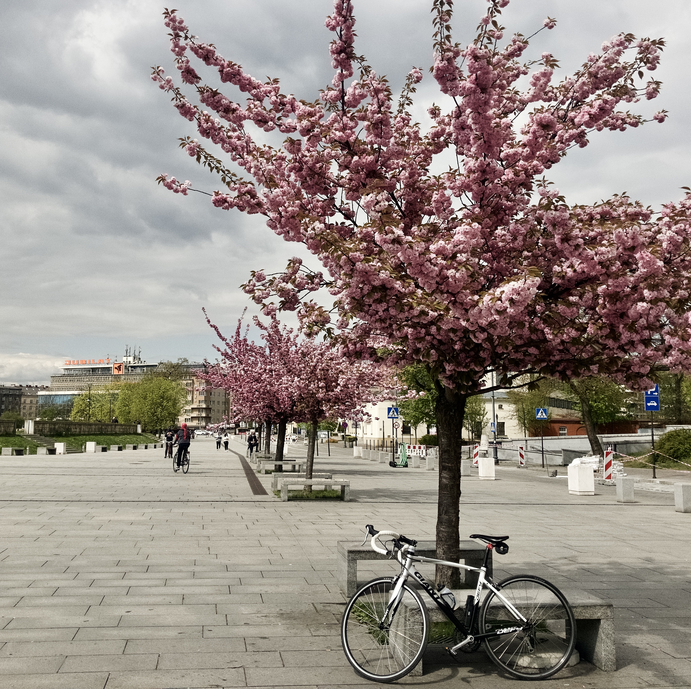
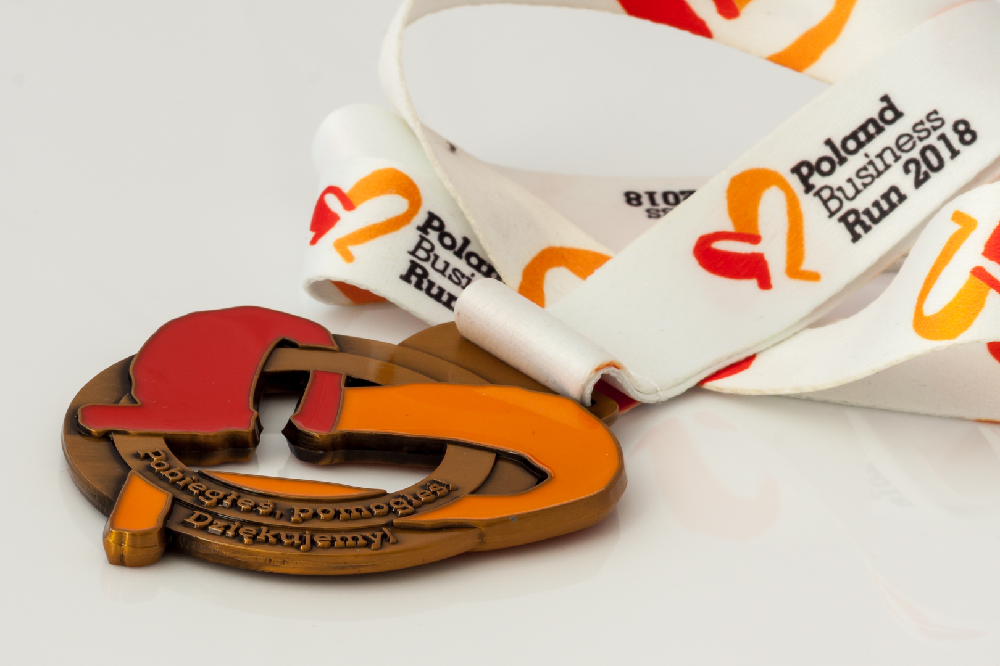



# Content developer

Throughout my IT career, I have worn a number of different hats. Nevertheless, my main role has been to develop content.

## Content types

My profession goes by different names, including: **technical writer**, **technical documentation specialist**, **information developer**, or **content developer**.

Since I have had an opportunity to develop a wide variety of assets, I find the most general **content developer** term the most apt to describe my occupation.

### Guides

* User guides
* Internal guides
* Reference guides
* Installation guides
* Configuration guides
* Disaster recovery guides
{: .items}

### Content architecture

* Style guides
* Asset inventories
* Content strategies
* Conceptual designs
{: .items}

### Media

* GIFs
* Videos
* Diagrams
* Screenshots
{: .items}

### Sales

* RFP responses
* RFQ responses
* RFI responses
{: .items}

## Output formats

My documentation has been published to a number of formats, including:

* PDFs
* Documentation portals
* Embedded help systems
* Static sites (WebHelps)
{: .items}

## Tools and technologies

Professionally, I have mainly worked with **oXygen XML Editor** integrated with a **CCMS** and the **DITA XML** markup language. For personal purposes, I use **Visual Studio Code**, **GitHub**, and **Markdown**.

For detailed information, feel free to see my [resume](resume.html).

# Agile leader

Does Scrum work in every content development team? Yes and no. Does every content development team need an Agile leader? Yes.

## Methodology

Scrum was designed as a work framework with an emphasis on software development teams. While it is possible to treat [docs as code](https://www.writethedocs.org/guide/docs-as-code/){:target="_blank"}, content and software development are still significantly different processes. The difference between them is particularly prominent if content creators are not regular members of software development teams.

I consider the [Scrum Guide](https://www.Scrumguides.org/index.html){:target="_blank"} a great basis for building an Agile framework in any development team. However, I often take the liberty of proposing, test-driving, and implementing various alterations to the approach suggested in the guide. If the docs tend to be developed on an ad hoc basis, I am not afraid of gravitating towards the Kanban framework.

## Tools

As a person who always has a clean desk, I enjoy well-curated backlogs, clearly defined items, flawless filters, and model burndown charts.

My weapon of choice is **Jira**; however, I am open to any alternative WMS solutions. For some teams, I also find **Confluence** a good and well-integrated addition to **Jira**.

I am an ardent supporter of keeping everything related to work management in a single place (WMS). In the long run, an avalanche of shared sheets and docs is not a maintainable approach.

# Coder

Did you know that [Stack Overflow](https://www.stackoverflow.com) is a fantastic place?

## Backend

Automate, optimize, and save the end users from the terminal.

### Python

I am a self-taught Python coder who automates repetitive tasks, batch-converts content, and makes life easier for less tech-savvy users, who prefer to steer clear of the terminal window.  
I am a fan of the [Automate the Boring Stuff with Python](https://automatetheboringstuff.com/){:target="_blank"} book and course.

### Ruby

I know Ruby enough to set up Jekyll locally and generate static sites. I can also publish [RubyGems](https://rubygems.org/profiles/rafalkaron){:target="blank"}.

### Node.js

I mainly use Node.js to initialize local development environments for frameworks such as Gatsby or Docusaurus, build packages, and deploy web apps builds.

## Frontend

Does every content developer dream of styling their content, or is it just me?

### Basic web technologies

HTML
: I am proficient in using semantic HTML5.

CSS
: I am skilled in using CSS for styling different media, including: websites, web apps, printed media (PDFs).

JavaScript
: I'm currently learning JavaScript. I can manipulate the HTML DOM and create simple web apps.

### PDF styling

I have a vast experience in styling PDF templates with HTML, CSS, a touch of XSLT, and the [Prince XML](https://www.princexml.com/) converter. To reduce the maintenance time, I always make my templates modular, customizable, and extensible.

### Jekyll sites development

I have a considerable experience in designing, developing, and styling Jekyll sites. As a content developer that uses DITA professionally, I aim at separating content from styling and making it as semantic as possible.

### Gatsby sites development

I have some experience in customizing sites generated by using Gatsby with LESS, TypeScript, and Material Design in mind.

### Docusaurus sites development

I am experienced in styling Docusaurus sites, extending Docusaurus sites functionalities and modifying their behavior.

# Tester

Does anyone need to break an app or get fussy about the UX?

Documenting software often involves clicking through the GUI or using the CLI. Because of that, as a by-product of the docs development, I often find:

* Curious bugs
* UX issues
* UI inconsistencies

As an Agile leader, I can log bugs, improvements, and feature suggestions like a fully-fledged tester. Additionally, my technical writing expertise enables me to clearly define STR and AC.

# Teacher

Once a teacher, always a teacher.

Having a master's degree and some experience in teaching English helps me to:

* Clearly formulate procedural steps
* Onboard new employees and conduct workshops
* Efficiently communicate with my Scrum team and SMEs
* Confidently demonstrate how software or processes work

# After hours

I am keen on cutting-edge technologies and discovering creative business models. I can appreciate art and design in many forms. I enjoy individual sports and books that broaden my worldview. I am a minimalist who requires a clean room to relax properly. I value privacy so I'm not really active on social media.

## Tech

I believe that any content developer in the IT sector should be a tech geek. It is much easier to document the things that you find interesting.

I enjoy discussing and ranting about tech trends and modern business models with my fellow content developers.

I stay up to date with the latest tech news mainly by subscribing to the [MKBHD](https://www.youtube.com/user/marquesbrownlee) and [Tech Linked](https://www.youtube.com/channel/UCeeFfhMcJa1kjtfZAGskOCA) YouTube channels as well as by following the major IT industry players on Twitter.

## Photography

I realize that nowadays any decent smartphone is capable of capturing and processing stunning photos. At the same time, I still enjoy setting up my Canon DSLR and manually developing RAW photos in Lightroom.

I shoot various kinds of photos ranging from portraits through macros to abstracts. If you're curious about my approach to photography, feel free to visit my [500px](https://500px.com/p/rafalkaron?){:target="_blank"} profile.

{:width="500px;" .center .shadow}

## Origami

I find paper folding both intricate and relaxing. Also, paper figurines make fantastic gifts!
{:width="500px;" .center .shadow}

## Cycling

I spent half of my childhood in a local bicycle shop and I love cycling. I can assemble and fix a bike.
{:width="500px;" .center .shadow}

## Running

Usually, I run alone or with my friend. However, I took part in the [Business Run 2018](https://live.sts-timing.pl/businessrun2018/person.php?n=63&d=1){:target="_blank"} as one of the **Motorola Solutions Gatekeepers** runners.

{:width="500px;" .center .shadow}
