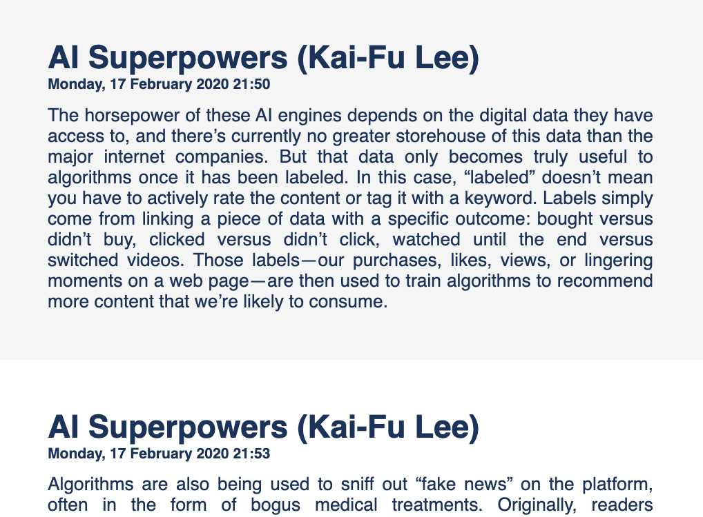
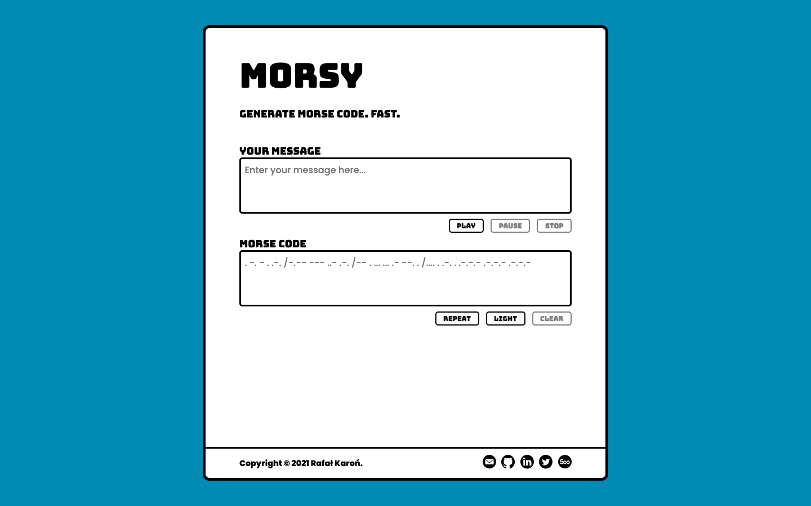
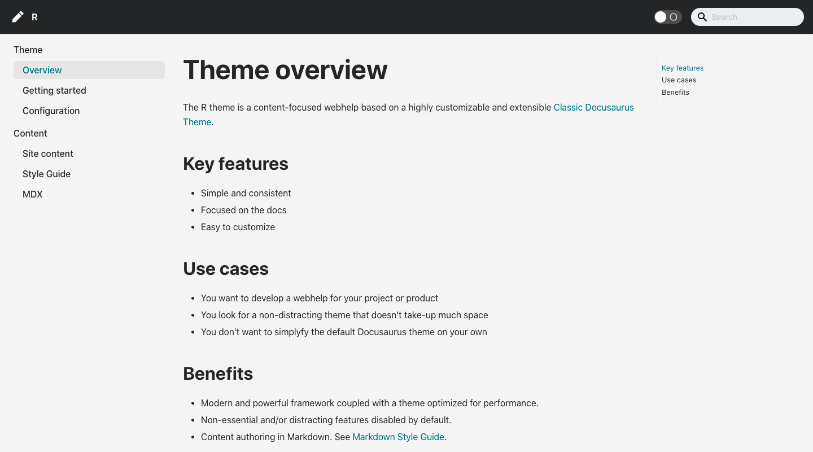



# Klipps 

[Klipps](https://github.com/rafalkaron/klipps){:target="_blank" title="Klipps on GitHub"} enables you to export your Kindle clippings to a static site.  
You can open the exported static site in any web browser and share it with your friends.

## Kindle clippings

When you highlight a sentence in Kindle, the sentence is saved to the [My Clippings.txt](assets/media/klipps/My%20Clippings.txt){:target="_blank" title="Sample Kindle clippings file"} file. The file often packs interesting content but it always looks dull.  

{:width="360px;" .center .shadow}

## Exporting Kindle clippings

You can use Klipps to convert your Kindle clippings to a static site in three simple steps.

1. By using a USB cable, connect your Kindle to a PC or Mac.
2. Download Klipps.
3. Run Klipps.  
**Result:** The [My Clippings.html](assets/media/klipps/My%20Clippings.html){:target="_blank" title="Sample Klipps output"} file is saved to your desktop and automatically opened in your web browser.

{: title="Sample Klipps output" .shadow .center width="580px;"}

## Related links

* [Klipps on GitHub](https://github.com/rafalkaron/Klipps){:target="_blank"}

# Hosty 

[Hosty](https://github.com/rafalkaron/hosty){:target="_blank" title="Hosty on GitHub"} enables you to host a website on a local web server without the need to open a terminal.

## Interface

{: .shadow}

## Use cases

Hosty comes in handy if you want to locally:

* Test or troubleshoot a website or a web app
* Preview a static site  

Some advanced WebHelps may need to be hosted on a web server to display content correctly.
{: .note_tip}

## Related links

* [Hosty on GitHub](https://github.com/rafalkaron/Hosty){:target="_blank"}
* [MDN: What is a web server?](https://developer.mozilla.org/en-US/docs/Learn/Common_questions/What_is_a_web_server){:target="_blank"}

# importaint

[importaint](https://github.com/rafalkaron/importaint){:target="_blank" title="importaint on GitHub"} is a CLI tool that enables you to compile a CSS file with `@import` rules into a resolved CSS file without the `@import` rules.

## Interface

```
Compile a CSS file with imports into a resolved CSS file without imports.

positional arguments:
  input_path            a filepath or URL to a CSS file with imports that you
                        want to compile

optional arguments:
  -h, --help            show this help message and exit
  -out output_dir, --output output_dir
                        manually specify the output folder. For remote files,
                        defaults to desktop. For local files, defaults to the
                        input file folder.
  -m, --minify          minify the compiled CSS
  -rc, --remove_comments
                        remove comments from the compiled CSS
  -c, --copy            copy the compiled CSS to clipboard
  -v, --version         show program's version number and exit
```

## Example

importaint resolves both local and external imports.

### Before

The following example shows an **uncompiled CSS** file with two `@import` rules.

```css
@import url("modules/module_a.css");
@import url("https://rafalkaron.github.io/modules/module_b.css");

/* list items */
li {
    margin: 0.8rem 0;
}
```

### After

The following example shows a **compiled CSS** file with resolved `@import` rules.

```css
/* resolved module_a.css */
p {
  margin-top: 5rem;
}

/* resolved module_b.css */
a {
    text-decoration: none;
    border-bottom: 0.25rem solid blue;
}

a:hover,
a:active,
a:focus {
    color: blue;
}

/* list items */
li {
    margin: 0.8rem 0;
}
```

## Extra features

Apart from compiling CSS files, importaint enables you to:

* Define a custom output directory
* Remove `/* comments */` from the compiled CSS code
* Minify the compiled CSS code
* Copy the compiled CSS code to clipboard

## Use cases

importaint is useful if you want to:

* Optimize your CSS code
* Implement a single compiled CSS file
* Keep your code modular and produce monoliths for your customer

## Related links

* [importaint on GitHub](https://github.com/rafalkaron/importaint){:target="_blank"}
* [MDN: @import](https://developer.mozilla.org/en-US/docs/Web/CSS/@import){:target="_blank"}

# MarkUP

[MarkUP](https://github.com/rafalkaron/markup){:target="_blank" title="MarkUP on GitHub"} is a CLI tool that enables you to batch-convert Markdown or HTML to DITA.

## Interface

```
Batch-convert Markdown and HTML files.

positional arguments:
  input                 provide a filepath to a file or a folder with files that you want to convert
  convert               set the conversion type:
                         * md_dita - convert Markdown to DITA
                         * html_dita - convert HTML to DITA
                         * md_html - convert Markdown to HTML
                         * html_md - convert HTML to Markdown

optional arguments:
  -h, --help            show this help message and exit
  -v, --version         show program's version number and exit
  -out output_dir, --output output_dir
                        manually specify the output folder (defaults to the input folder)
```

## Conversion types

MarkUP supports the following conversion types:

* Markdown → DITA
* HTML → DITA
* Markdown ↔ HTML

## Example

The following example shows a Markdown file converted to DITA.

Currently, MarkUP converts content only to DITA concept topics. You may need to refactor the DITA code after the conversion.
{:.note}

### Before

```markdown
# MarkUP

Batch-convert Markdown and HTML files.

## Before you begin
1. Download the newest **MarkUP** version. See [Download MarkUP](https://github.com/rafalkaron/MarkUP/releases/latest).
2. Unzip **MarkUP**.

## Usage
1. In a terminal app, run: `markup <source> <conversion_type> --output <output_dir>`  
    Where:
    * **&lt;source&gt;** (required) is the file or directory that contains files that you want to convert.
    * **&lt;conversion_type&gt;** (required) is one of the following:
        * `md_dita` - converts Markdown to DITA
        * `html_dita` - converts HTML to DITA
        * `md_html` - converts Markdown to HTML
        * `html_md` - converts HTML to Markdown
    * **--output** or **-out** (optional) precedes the directory where you want to save the converted files.  
    **TIP:** By default the output directory is the same as the input directory.
2. If needed, accept any security prompt. For more information, see [Accepting macOS Security Prompts](https://github.com/rafalkaron/MarkUP/wiki/Accepting-macOS-Security-Prompts) or [Accepting Windows Security Prompts](https://github.com/rafalkaron/MarkUP/wiki/Accepting-Windows-Security-Prompts).

## Examples
The following converts every Markdown file to DITA in the `Downloads` directory.
```MarkUP "/Users/user_name/Downloads" md_dita
```The following coverts the `README.html` file to DITA in the `Desktop` directory.
```MarkUP "/Users/user_name/Desktop/README.html" html_dita
```The following converts every Markdown file from the `Downloads` directory to HTML and saves the HTML files to the `Destkop` directory.
```MarkUP "/Users/user_name/Downloads" md_html -out "/Users/user_name/Desktop/"```
```

### After

A DITA concept file is generated with:

* A random `@ID` attribute
* The  `<title>` element generated from the input file name

```xml
<?xml version="1.0" encoding="utf-8"?>
<!DOCTYPE concept PUBLIC "-//OASIS//DTD DITA Concept//EN" "concept.dtd">
<concept xml:lang="en-us" id="concept-5593bbda-0c44-4c17-9c92-75d98901f065">
    <title>README</title>
    <shortdesc></shortdesc>
    <conbody>
        <section>
            <title>MarkUP</title>
            <p>Batch-convert Markdown and HTML files.</p>
        </section>
        <section>
            <title>Before you begin</title>
            <ol>
                <li>Download the newest <b>MarkUP</b> version. See <xref href="https://github.com/rafalkaron/MarkUP/releases/latest">Download MarkUP</xref>.
                </li>
                <li>Unzip <b>MarkUP</b>.
                </li>
            </ol>
        </section>
        <section>
            <title>Usage</title>
            <ol>
                <li>In a terminal app, run: <codeph>markup &lt;source&gt; &lt;conversion_type&gt; --output &lt;output_dir&gt;</codeph>
                    <br>
 Where:<ul>
                        <li>
                            <b>&lt;source&gt;</b> (required) is the file or directory that contains files that you want to convert.</li>
                        <li>
                            <b>&lt;conversion_type&gt;</b> (required) is one of the following:<ul>
                            <li>
                                <codeph>md_dita</codeph> - converts Markdown to DITA</li>
                            <li>
                                <codeph>html_dita</codeph> - converts HTML to DITA</li>
                            <li>
                                <codeph>md_html</codeph> - converts Markdown to HTML</li>
                            <li>
                                <codeph>html_md</codeph> - converts HTML to Markdown</li>
                        </ul>
                    </li>
                    <li>
                        <b>--output</b> or <b>-out</b> (optional) precedes the directory where you want to save the converted files.<br>
                        <b>TIP:</b> By default the output directory is the same as the input directory.</li>
                </ul>
            </li>
            <li>If needed, accept any security prompt. For more information, see <xref href="https://github.com/rafalkaron/MarkUP/wiki/Accepting-macOS-Security-Prompts">Accepting macOS Security Prompts</xref> or <xref href="https://github.com/rafalkaron/MarkUP/wiki/Accepting-Windows-Security-Prompts">Accepting Windows Security Prompts</xref>.
            </li>
        </ol>
    </section>
    <section>
        <title>Examples</title>
        <p>The following converts every Markdown file to DITA in the <codeph>Downloads</codeph> directory.</p>
        <codeblock>MarkUP "/Users/user_name/Downloads" md_dita</codeblock>
        <p>The following coverts the <codeph>README.html</codeph> file to DITA in the <codeph>Desktop</codeph> directory.</p>
        <codeblock>MarkUP "/Users/user_name/Desktop/README.html" html_dita</codeblock>
        <p>The following converts every Markdown file from the <codeph>Downloads</codeph> directory to HTML and saves the HTML files to the <codeph>Destkop</codeph> directory.</p>
        <codeblock>MarkUP "/Users/user_name/Downloads" md_html -out "/Users/user_name/Desktop/"</codeblock>
    </section>
</conbody>
</concept>
```

## Use cases

MarkUP is useful if you want to:

* Migrate your Markdown or HTML documentation to DITA
* Convert HTML to Markdown or vice versa

## Related links

* [MarkUP on GitHub](https://github.com/rafalkaron/markup){:target="_blank"}
* [Markdown Guide](https://www.markdownguide.org/){:target="_blank"}
* [DITA Specs](http://docs.oasis-open.org/dita/dita/v1.3/dita-v1.3-part3-all-inclusive.html){:target="_blank"}

# PrincePal

[PrincePal](https://github.com/rafalkaron/princepal){:target="_blank" title="PrincePal on GitHub"} is a CLI tool that makes it easier to preview PDF documents produced with [Prince](https://www.princexml.com/){:target="_blank"}.

## Prerequisites

To use PrincePal, you need to install Prince first. For more information, see the [Prince Installation Guide](https://www.princexml.com/doc/installing/){:target="_blank"}.

## Interface

```
Preview your PDFs like a prince!

optional arguments:
  -h, --help            show this help message and exit
  -v, --version         show program's version number and exit
  -rm, --remove_pdfs    USE WITH CAUTION: Permanently remove PDF files from
                        the script directory
  -nopr, --no_preview   prevent PDFs from opening after publication
  -yolo, --you_live_only_once
                        combine with the '-rm' argument to permanently remove
                        the PDF files from the script directory without
                        confirmation.
  -jobs jobs, --concurrent_jobs jobs
                        determine the number of concurrent jobs (defults to
                        12)
  -cwd, --current_working_directory
                        Use HTML files in the script directory as an input
  -i INPUT, --input INPUT
                        Pick a source file or source folder on your own
  -o OUTPUT, --output OUTPUT
                        Pick the output folder on your own
  -s STYLE, --style STYLE
                        Pick the output folder on your own
```

## Key Features

PrincePal enables you to:

* Batch-convert HTML files and preview the converted PDF files
* Specify the styling for PDF files
* Specify the input and output directories

## Related links

* [PrincePal on GitHub](https://github.com/rafalkaron/princepal){:target="_blank"}
* [Prince Converter](https://www.princexml.com/){:target="_blank"}

# Morsy

An online plaintext to Morse code converter.

{: title="Morsy" .shadow .center"}

## Technologies used

I used the following technologies to develop Morsy:

* HTML
* CSS
* Vanilla JavaScript

## Features

Morsy includes the following features:

* Instant conversion
* Playback controls
* Light signals

## Related links

* [Morsy](https://rafalkaron.github.io/morsy/){:target="_blank"}
* [Morsy on GitHub](https://github.com/rafalkaron/morsy/){:target="_blank"}

# R Docusaurus theme

The R theme is a content-focused web help based on a highly customizable and extensible Classic Docusaurus Theme.

{: title="Docusaurus" .shadow .center"}

## Related links

* [r-docusaurus-theme on GitHub](https://github.com/rafalkaron/r-docusaurus-theme){:target="_blank"}
* [r-docusaurus-theme preview](https://rafalkaron.github.io/r-docusaurus-theme/){:target="_blank"}

# R Jekyll theme

A simple red Jekyll theme with left navigation that's perfect for portfolios, resumes, and simple personal blogs.
This very site is based on the R Jekyll theme.

## Technologies

I used the following technologies to develop the theme:

Ruby
: Setting up a local Jekyll development environment.

Liquid
: Outputting variables and controlling the template logic.

HTML
: Specifying the page layout.

SCSS
: Styling the site for different media types and devices.

YAML
: Defining the site configuration, metadata, and contact information.

Kramdown
: Authoring the site content.
{: .two_column}

## Related links

* [rafalkaron.github.io on GitHub](https://github.com/rafalkaron/rafalkaron.github.io){:target="_blank"}
* [r-jekyll-theme on GitHub](https://github.com/rafalkaron/r-jekyll-theme){:target="_blank"}
* [r-jekyll-theme preview](https://rafalkaron.github.io/r-jekyll-theme/){:target="_blank"}
* [Jreel - Social media icons on jekyll](https://jreel.github.io/social-media-icons-on-jekyll/){:target="_blank"}
* [Allejo - jekyll-toc](https://github.com/allejo/jekyll-toc){:target="_blank"}
